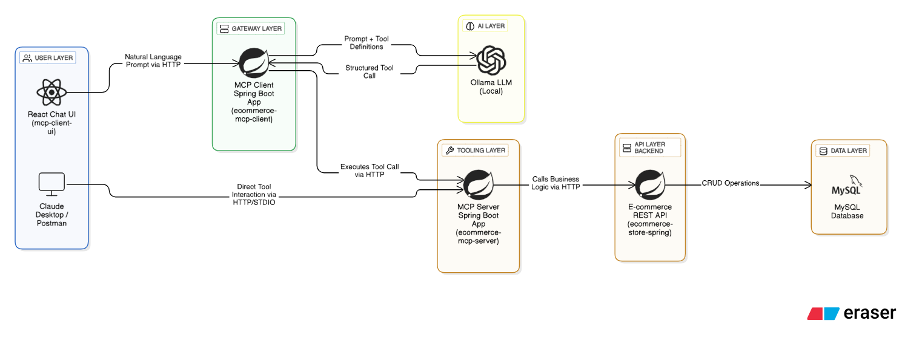

## E-commerce MCP Client Gateway

## Table of Contents

- [Description](#description)
- [Architecture](#architecture)
- [Key Features](#key-features)
- [Getting Started](#getting-started)
- [Usage and API Endpoints](#usage-and-api-endpoints)
- [Configuration](#configuration)
- [Contact](#contact)

## Description

This project is an MCP Client Gateway built with Spring Boot and Spring AI. It serves as a sophisticated backend-for-frontend (BFF) that connects a user interface (like a chat application) to the [ecommerce-mcp-server](https://github.com/surajbadhe/ecommerce-mcp-server).

Its core responsibility is to receive natural language prompts from a user, use a local LLM (Ollama) to interpret the user's intent, and translate that intent into structured tool calls that are executed by the remote MCP server. This creates a seamless, conversational experience for interacting with a complex backend system.

## Architecture

This application is the central gateway in a multi-service architecture, orchestrating communication between the user, the AI model, and the backend tool server.



## Key Features

- **RESTful Gateway:** Provides a simple `/api/chat` endpoint, abstracting the complexity of the entire backend system from the frontend.
- **Intelligent Prompt Orchestration:** Uses an LLM (Ollama) to understand user text and decide which backend tool to call.
- **MCP Tool Proxy:** Connects to a remote MCP server and exposes its tools to the LLM as if they were local functions.
- **CORS Enabled:** Pre-configured to allow requests from a frontend running on `localhost:3000`.
- **Built with Spring AI:** Leverages the official `spring-ai-starter-mcp-client` for robust and efficient communication.

## Getting Started

### Prerequisites

- Java JDK 21
- Maven 3.8.1 or higher
- Ollama server running locally with a pulled model (e.g., `ollama pull llama3.2:3b`)
- [Ecommerce MCP Server](https://github.com/surajbadhe/ecommerce-mcp-server) running and accessible (default: `http://localhost:8089`)
- [E-commerce Store Spring](https://github.com/surajbadhe/ecommece-store-spring) Backend REST API running and accessible (default: `http://localhost:8088`)

### Installation

Clone the repository:

```bash
git clone https://github.com/surajbadhe/ecommerce-mcp-client.git
cd ecommerce-mcp-client
```

Build the project:

```bash
mvn clean install
```

## Usage and API Endpoints


Run the application using Maven or the generated JAR file. The server will start on port `8083` by default.

**Using Maven:**

```bash
mvn spring-boot:run
```

**Using JAR:**

```bash
java -jar target/ecommerce-mcp-client-gateway-0.0.1-SNAPSHOT.jar
```

This application is designed to be called by a frontend client (like a React chat app) and exposes two primary endpoints for different chat functionalities.

### 1. Chat with MCP Tools
This is the main endpoint for interacting with your e-commerce backend using natural language. It uses the LLM to translate prompts into tool calls for the remote MCP server.

**Endpoint:** `POST /api/mcp/chat`

- **Request Body:** `String` (The user's natural language prompt, e.g., "Show me all the Nike products")
- **Response:** `String` (The AI's final, human-readable answer)

### 2. Chat with Conversational Memory
This endpoint provides a standard chatbot experience that remembers the last 10 messages in a conversation. It does not use the MCP server tools.

**Endpoint:** `POST /api/memory/chat`

- **Query Parameter:** `conversationId` (optional UUID to continue a previous conversation)
- **Request Body:** `String` (The user's message)
- **Response:** A JSON object containing the `conversationId` and the AI's message.

Example response:

```json
{
	"conversationId": "123e4567-e89b-12d3-a456-426614174000",
	"message": "This is the AI's response."
}
```

## Configuration

Configuration is managed via `src/main/resources/application.properties`.

- `server.port`: Port for this gateway application (default: 8090)
- `spring.ai.mcp.client.sse.connections.ecommerce-server.url`: The full URL to the running MCP server's SSE endpoint (e.g., `http://localhost:8089`)
- `spring.ai.ollama.base-url`: The URL for your local Ollama instance
- `spring.ai.ollama.chat.options.model`: The specific Ollama model to use

## Contact

- **Maintainer:** Suraj Badhe
- **GitHub:** [surajbadhe](https://github.com/surajbadhe)
